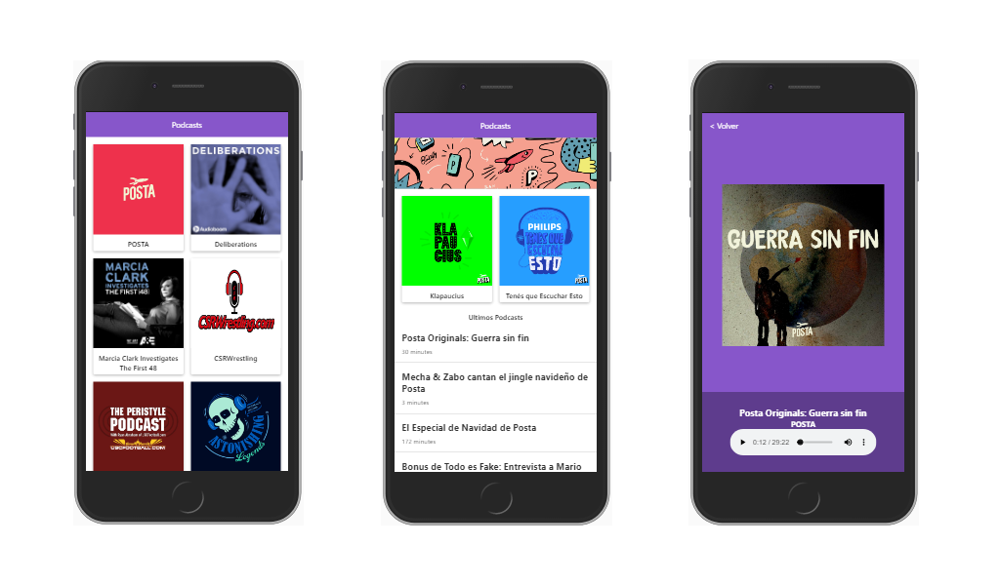

# App de Podcasts del [Curso de Next.JS de Platzi](https://platzi.com/cursos/next-js/ 'Curso de Next.JS de Plazi') impartido por Roberto González

App de Podcasts integrada con la API de AudioBoom para aprender Next.JS. Como reto personal se utilizó TypeScript para construir el proyecto.

### Vista de la app movil

### Vista de la app web

[Ver el proyecto](https://podcast-nextjs.juanchordg03.now.sh/)

## ¿Cómo funciona?

### Con Node.JS:

Requiere Node.JS 12

- `npm install` para instalar las dependencias.
- `npm run dev` para el entorno de desarrollo.
- `npm run build && npm start` para el entorno de producción.

### Con Docker:

- `docker-compose up -d` para crear y ejecutar el contenedor.

## Licencia

MIT
